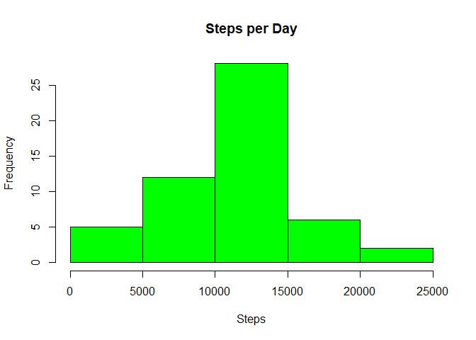
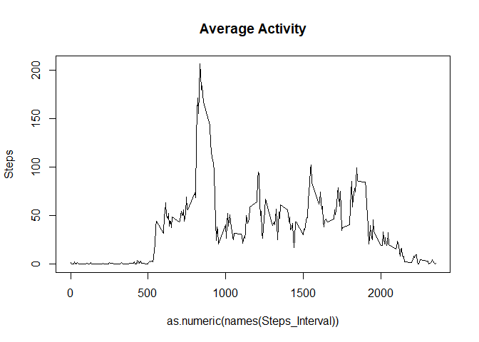
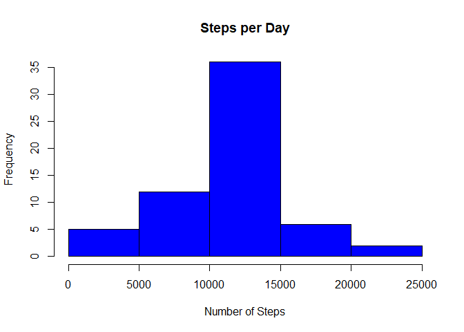
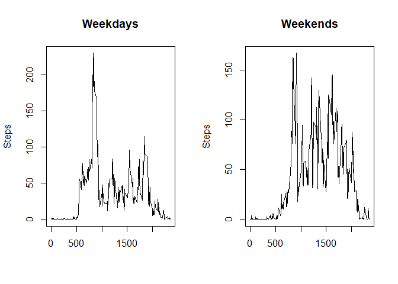

## Loading and preprocessing the data


```r
Url <- "https://d396qusza40orc.cloudfront.net/repdata%2Fdata%2Factivity.zip"
download.file(Url, destfile = paste0(getwd(), '/repdata%2Fdata%2Factivity.zip'))
unzip("repdata%2Fdata%2Factivity.zip")
data<- read.csv("activity.csv", header = TRUE)
```
## What is mean total number of steps taken per day?


```r
##determine total steps per day
Steps_Day<- tapply(data$steps, data$date, sum)

##create histogram
hist(Steps_Day, xlab = "Steps", main = "Steps per Day", col = "green")
```

<!-- -->

```r
##take the mean and the median
Mean_Day <- mean(Steps_Day, na.rm = TRUE)
Median_Day <- median(Steps_Day, na.rm = TRUE)

Mean_Day
```

```
## [1] 10766.19
```

```r
Median_Day
```

```
## [1] 10765
```
## What is the average daily activity pattern?


```r
##create 5-min interval plot
Steps_Interval <- tapply(data$steps, data$interval, mean, na.rm = TRUE)
plot(as.numeric(names(Steps_Interval)), Steps_Interval, ylab = "Steps", main = "Average Activity", type = "l")
```

<!-- -->

```r
##determine max interval and max steps
maxInterval <- names(sort(Steps_Interval, decreasing = TRUE)[1])
maxSteps <- sort(Steps_Interval, decreasing = TRUE)[1]

maxSteps
```

```
##      835 
## 206.1698
```
## Imputing missing values


```r
##calculate number of na values
na_values <- sum(is.na(data$steps))

na_values
```

```
## [1] 2304
```

```r
##replace na values with mean value
Steps_Interval <- tapply(data$steps, data$interval, mean, na.rm = TRUE)
data_split <- split(data, data$interval)
for(i in 1:length(data_split)){
     data_split[[i]]$steps[is.na(data_split[[i]]$steps)] <- Steps_Interval[i]
}
new_data<- do.call("rbind", data_split)
new_data<- new_data[order(new_data$date) ,]

## create histogram with new step count
New_Steps_Day <- tapply(new_data$steps, new_data$date, sum)
hist(New_Steps_Day, xlab = "Number of Steps", main = "Steps per Day", col = "blue")
```

<!-- -->

```r
##create new mean and median to identify any changes
New_Mean_Day <- mean(New_Steps_Day, na.rm = TRUE)
New_Median_Day <- median(New_Steps_Day, na.rm = TRUE)

New_Mean_Day
```

```
## [1] 10766.19
```

```r
New_Median_Day
```

```
## [1] 10766.19
```
## Are there differences in activity patterns between weekdays and weekends?


```r
new_data$day <- ifelse(weekdays(as.Date(new_data$date)) == "Saturday" | weekdays(as.Date(new_data$date)) == "Sunday", "weekend", "weekday")

##determine average steps for weekdays and weekends
Steps_Interval_Weekday <- tapply(new_data[new_data$day == "weekday" ,]$steps, new_data[new_data$day == "weekday" ,]$interval, mean, na.rm = TRUE)
Steps_Interval_Weekend <- tapply(new_data[new_data$day == "weekend" ,]$steps, new_data[new_data$day == "weekend" ,]$interval, mean, na.rm = TRUE)

# plot the comparison of activity
par(mfrow=c(1,2))
plot(as.numeric(names(Steps_Interval_Weekday)), Steps_Interval_Weekday, xlab = "", ylab = "Steps", main = "Weekdays", type = "l")
plot(as.numeric(names(Steps_Interval_Weekend)), Steps_Interval_Weekend, xlab = "", ylab = "Steps", main = "Weekends", type = "l")
```

<!-- -->
